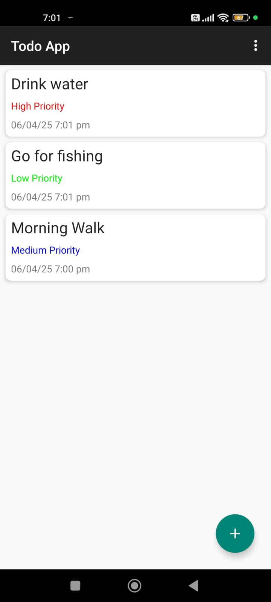
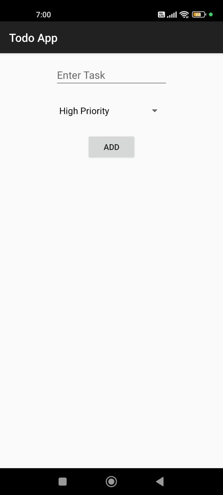
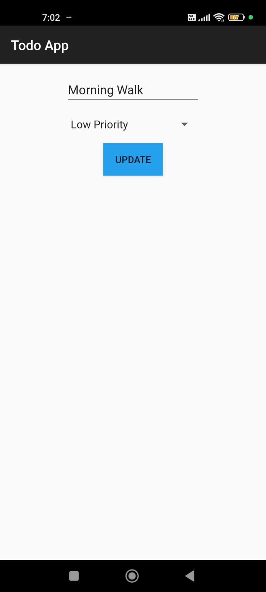
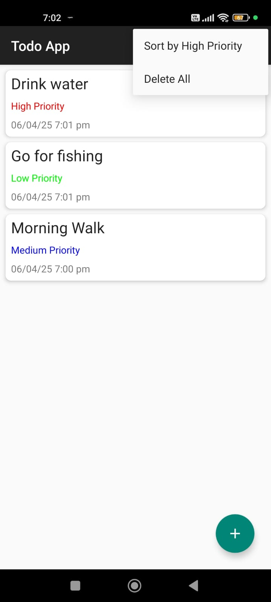

# To-Do MVVM App 📝

A task management app built using **Kotlin**, **XML (UI)**, **Room DB**, and **Jetpack Navigation Component**, following the **MVVM architecture**.

## ✨ Features

- ➕ Add, ✏️ Update, and ❌ Delete individual tasks
- 🗑️ Delete all tasks with confirmation
- 🔽 Sort tasks based on priority (High, Medium, Low)
- 👆 Swipe to delete with **Undo** option (using Snackbar)

## 🛠️ Tech Stack

- **Language:** Kotlin  
- **UI:** XML  
- **Architecture:** MVVM  
- **Database:** Room  
- **Navigation:** Jetpack Navigation Component

## 📸 Screenshots

### 🏠 Home Screen

### ➕ Add Task Screen

### ✏️ Update Task Screen

### ❌ Sort or Delete All Task Screen

